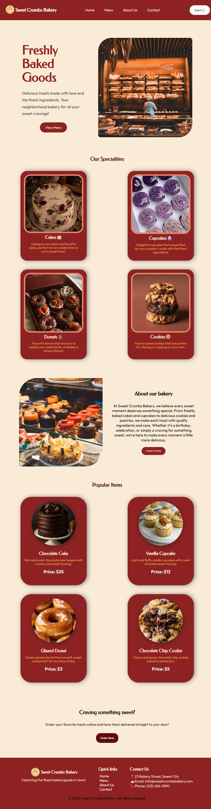

# Sweet Crumbs Bakery 🍰

A simple bakery website created using HTML and CSS. The website presents the bakery, its menu, and contact information through a clean and modern interface.

## 📌 Features

* Home page
* Bakery menu page
* About page
* Contact page
* Navigation between pages
* Custom styling and layout
* Bakery-themed design

## 🛠️ Technologies Used

* HTML5
* CSS3

## 📂 Project Structure

```text
Sweet-Crumbs-Bakery/
│
├── index.html
├── menu.html
├── about.html
├── contact.html
├── style.css
└── images/
```
## Preview



## 🚀 How to Run

1. Clone this repository or download the project.
2. Open the project folder in VS Code.
3. Open `index.html` using Live Server.
4. Explore the website through the navigation menu.

## 🎯 Purpose

This project was created to practice building a multi-page website using HTML and CSS, while improving frontend development and web design skills.

## 📄 License

This project is created for learning and personal portfolio purposes.
